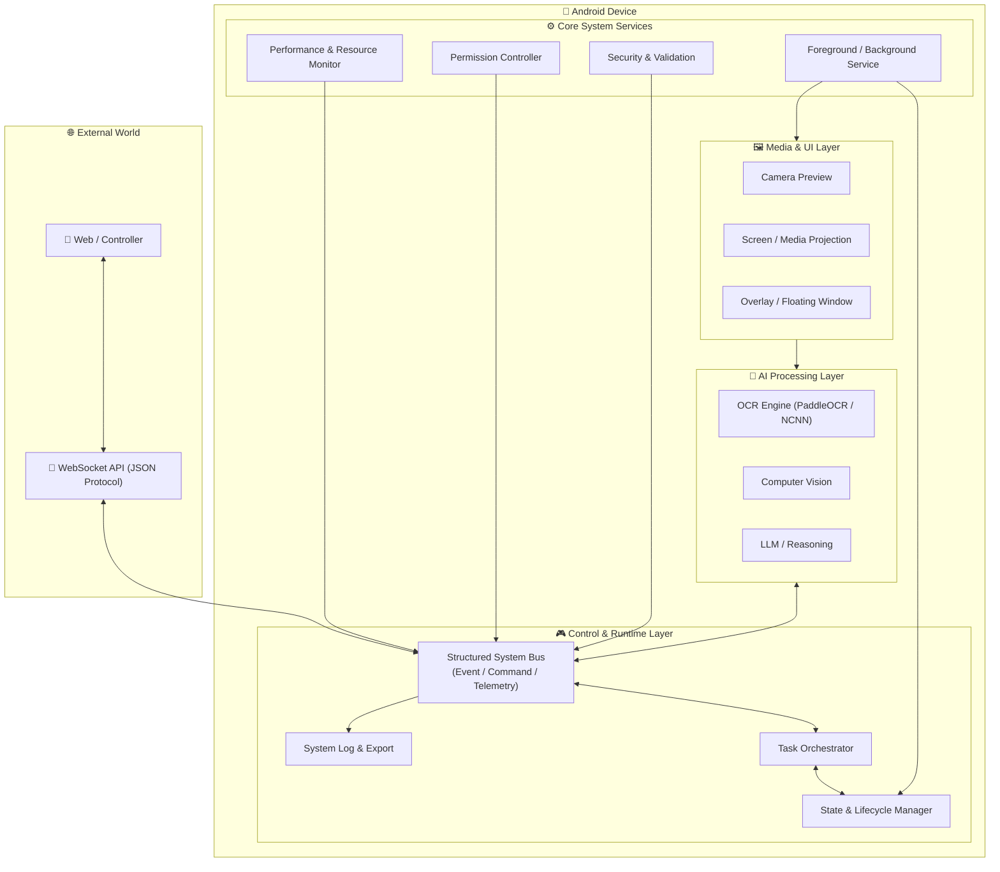

# android-control-ocr

**(Layer 1: Core System / Infrastructure + Layer 2: AI & OCR Capabilities)**

Android system-level control core featuring a persistent background service, **AI-powered OCR scanner**, overlay process, WebSocket command bus, and structured logging.

---

## 🌟 Key Features

### **🆕 AI & OCR Scanning (New)**

* **Advanced OCR Engine**: Powered by **NCNN** framework running **PP-OCRv4** (Mobile/Slim), enabling offline, ultra-fast, and accurate text recognition directly on Android devices.
* **Camera2 API Control**: Advanced camera management with custom resolution scaling, auto-focus, and flash control.
* **Real-Time Preview**: Low-latency camera preview implemented with **Jetpack Compose + TextureView**.
* **JSON Output**: OCR results are instantly formatted as JSON for easy parsing and integration with the web client.

### **WebSocket Communication (JSON-First)**

* **Server Mode**: Runs an internal WebSocket server inside the Android app (Port `8887`) for direct client connections.
* **JSON Protocol**: Uses JSON as the primary communication format between the Android app and the web client—lightweight, readable, and easy to debug.
* **Real-Time Control**: Supports real-time two-way commands from the web client (Ping, Notification, Authentication) with immediate responses.

### **Web Client Interface**

* Includes a ready-to-use web interface (`web_client/index.html`) for testing connections and sending commands.
* **Auto-Reconnect**: Automatically retries connection when disconnected.
* **Live Log Viewer**: View real-time logs and responses from the Android device directly in the browser.

### **Background Operation & Reliability 🛡️**

* **Heartbeat System**: Continuously sends status signals to the web client to confirm the app is alive—even when running in the background.
* **Smart State Tracking**: Uses `ProcessLifecycleOwner` & `BroadcastReceiver` to detect and broadcast real-time states (`SCREEN_OFF`, `BACKGROUND`, `FOREGROUND`) to connected clients via WebSocket.
* **Watchdog (Self-Healing)**: Implements `androidx.work.WorkManager` to wake up every 15 minutes, check service health, and perform **auto-revival** if the OS kills the process.
* **Foreground Service**: Ensures long-running execution without being killed by the system.
* **Auto-Start on Boot**: Automatically starts the service when the device boots (via Boot Receiver).

### **Logging & Export**

* **Structured Logs**: Logs include timestamps, components, events, and payload data.
* **JSON Export**: Logs can be exported as JSON files for offline analysis (local time aligned with Thailand timezone).

### **Security**

* **Passkey Authentication**: Requires a valid passkey before accepting any remote command.

### **Performance & Resource Monitoring**

* **Inference Latency**: Tracks the time taken for each OCR detection in milliseconds (ms) to optimize model performance.
* **System Metrics**:
    * **CPU**: Tracks thermal status and load (where available).
    * **RAM Usage**: Real-time memory usage (Used/Total MB).
    * **Battery**: Current level (%) and temperature monitoring.
* **Device Spec**: Automatically logs device model, Android version, and API level for debugging compatibility issues.

### **Internal Log System**

* Centralized logging via `LogRepository` for debugging, auditing, and reliability analysis.

---

## 🛠️ Installation & Usage

### Android App Side

1. **Install the Application**
   * Deploy the project to an Android device (Android 7.0+ supported).

2. **Permissions Setup** ⚠️ *Critical*
   * **Camera**: Required for OCR scanning functionality.
   * **Display over other apps**: Required for overlay rendering.
   * **Accessibility Service**: Enable `android-control-core` under *Settings > Accessibility*.

3. **Model Setup (OCR)**
   * The project uses **PaddleOCR** via NCNN.
   * Ensure the model assets (`.bin`, `.param` files) are correctly placed in `src/main/assets` if not already bundled.
   * The app will automatically initialize the OCR engine on first launch.

4. **Start the System**
   * Launch the app and tap **“Start Service”**
   * Go to the **OCR** tab to test the camera and text recognition.

---

## 🧠 Technical Architecture & Challenges

### **Models Used**
* **Inference Engine**: [ncnn-paddleocr](https://github.com/FeiGeChuanShu/ncnn_paddleocr) (Optimized for Android/ARM).
* **Model version**: **PP-OCRv4 Mobile / Slim** (Lightweight model for mobile devices).
    * Includes Text Detection (DBNet) + Text Recognition (SVTR_LCNet).
* **References & Documentation**:
    * [PaddlePaddle/PaddleOCR Repository](https://github.com/PaddlePaddle/PaddleOCR?tab=readme-ov-file)
    * [ncnn_paddleocr Repository (Implementation Base)](https://github.com/FeiGeChuanShu/ncnn_paddleocr)
    * [PaddleOCR Android Demo Guide](https://www.paddleocr.ai/main/en/version2.x/legacy/android_demo.html#33-running-the-demo)
    * [Paddle Lite Library Preparation](https://www.paddleocr.ai/main/en/version2.x/legacy/lite.html#12-prepare-paddle-lite-library)

---

## 🏗️ System Diagram (Updated)



---
## Unified OCR JSON Response Format

The newly integrated JSON structure merges standard OCR processing with real-time hardware telemetry and benchmarking. This allows downstream backend/WebSockets to consume a clean, production-ready payload directly from the edge devices.

```json
{
  "timestamp": 1726059123432,

  "engine_info": {
    "engine": "paddleocr",
    "version": "v4",
    "runtime": "ncnn",
    "model": "PP-OCRv4_mobile_rec"
  },

  "pipeline": "on-device",

  "device_info": {
    "model": "SM-G975F",
    "manufacturer": "samsung",
    "android_version": "12",
    "api_level": 31
  },

  "image_info": {
    "width": 1080,
    "height": 1920,
    "file_size_bytes": 1254320,
    "format": "jpeg"
  },

  "result": {
    "full_text": "PLAY\nGAME START",
    "lines": [
      {
        "text": "PLAY",
        "confidence": 0.99,
        "bbox": [450, 1020, 630, 1065],
        "polygon": [[450, 1020], [630, 1020], [630, 1065], [450, 1065]]
      }
    ]
  },

  "benchmark": [
    {
      "test_case": "full_image",

      "latency": {
        "preprocess_ms": null,
        "detection_ms": null,
        "recognition_ms": null,
        "total_ms": 320
      },

      "resource_usage": {
        "cpu_percent": 2.5,
        "ram_mb": 115
      }
    }
  ],

  "summary": {
    "text_object_count": 2,
    "average_confidence": 0.985,
    "total_latency_ms": 320
  }
}
```
---

## 📝 Engineering Notes

### Objectives (Latest Updates)

* **Stability First**: Focus on connection stability and command reliability before introducing video streaming.
* **True Two-Way Control**: Validate real remote control with confirmed acknowledgements (notifications + logs).
* **High Debuggability**: Improve logging detail and exportability to minimize time-to-resolution.

### Technical Overview

* **Architecture**: MVVM with a service-centric execution model.
* **Networking**:
  * Mobile server: `org.java_websocket` (Port 8887)
  * Web client: Browser WebSocket API
* **Security**: Passkey-based authentication before command execution.
* **Reliability**: Foreground Service + Heartbeat mechanism to maintain persistent connectivity.

---

## ✅ Completed Tasks

* [x] **Project Setup**
  * Android project with MVVM / Compose support
* [x] **Network Core**
  * WebSocket server (`RelayServer`) on port 8887
  * Custom JSON protocol design
* [x] **Web Client**
  * Controller dashboard (`index.html`)
  * Auto-reconnect, authentication, and log viewer
* [x] **OCR Integration (New)**
  * Camera2 API implementation in Compose
  * PaddleOCR (NCNN) linkage
  * JSON Result export
* [x] **Control System**
  * Heartbeat status reporting
  * Remote notification execution
  * Background execution support
  * **App State Awareness** (Screen On/Off, App Background detection)
  * **Watchdog Service** (Auto-restart via WorkManager)
* [x] **Logging System**
  * JSON log export (local time)
  * Reliable logging (no data loss)
  * Centralized `LogRepository` for auditing


---

## 🔗 References

* Java-WebSocket Library: [https://github.com/TooTallNate/Java-WebSocket](https://github.com/TooTallNate/Java-WebSocket)
* Android Foreground Services: [https://developer.android.com/guide/components/foreground-services](https://developer.android.com/guide/components/foreground-services)
* Android Accessibility Service: [https://developer.android.com/reference/android/accessibilityservice/AccessibilityService](https://developer.android.com/reference/android/accessibilityservice/AccessibilityService)
* MediaProjection API: [https://developer.android.com/guide/topics/large-screens/media-projection](https://developer.android.com/guide/topics/large-screens/media-projection)
* Reference App: *Let’s View* (background & overlay behavior)

