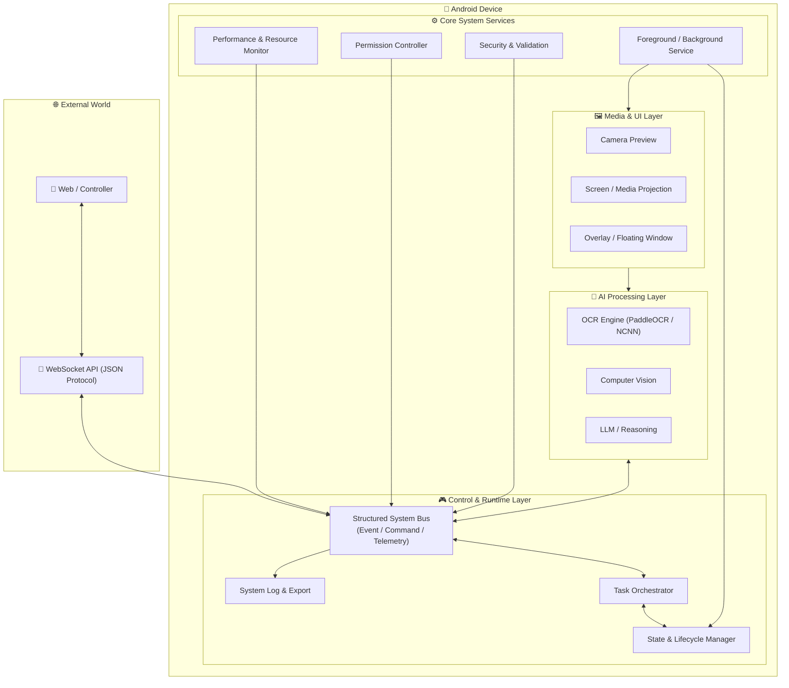

# android-control-ocr

**(Layer 1: Core System / Infrastructure + Layer 2: AI & OCR Capabilities)**

Android system-level control core featuring a persistent background service, **AI-powered OCR scanner**, overlay process, WebSocket command bus, and structured logging.

---

## 🌟 Key Features

### **🆕 AI & OCR Scanning (New)**

* **Advanced OCR Engine**: Powered by **NCNN** framework running **PP-OCRv4** (Mobile/Slim), enabling offline, ultra-fast, and accurate text recognition directly on Android devices.
* **Camera2 API Control**: Advanced camera management with custom resolution scaling, auto-focus, and flash control.
* **Real-Time Preview**: Low-latency camera preview implemented with **Jetpack Compose + TextureView**.
* **JSON Output**: OCR results are instantly formatted as JSON for easy parsing and integration with the web client.

### **WebSocket Communication (JSON-First)**

* **Server Mode**: Runs an internal WebSocket server inside the Android app (Port `8887`) for direct client connections.
* **JSON Protocol**: Uses JSON as the primary communication format between the Android app and the web client—lightweight, readable, and easy to debug.
* **Real-Time Control**: Supports real-time two-way commands from the web client (Ping, Notification, Authentication) with immediate responses.

### **Web Client Interface**

* Includes a ready-to-use web interface (`web_client/index.html`) for testing connections and sending commands.
* **Auto-Reconnect**: Automatically retries connection when disconnected.
* **Live Log Viewer**: View real-time logs and responses from the Android device directly in the browser.

### **Background Operation**

* **Heartbeat System**: Continuously sends status signals to the web client to confirm the app is alive—even when running in the background.
* **Foreground Service**: Ensures long-running execution without being killed by the system.
* **Auto-Start on Boot**: Automatically starts the service when the device boots (via Boot Receiver).

### **Logging & Export**

* **Structured Logs**: Logs include timestamps, components, events, and payload data.
* **JSON Export**: Logs can be exported as JSON files for offline analysis (local time aligned with Thailand timezone).

### **Security**

* **Passkey Authentication**: Requires a valid passkey before accepting any remote command.

### **Performance & Resource Monitoring**

* **Inference Latency**: Tracks the time taken for each OCR detection in milliseconds (ms) to optimize model performance.
* **System Metrics**:
    * **CPU**: Tracks thermal status and load (where available).
    * **RAM Usage**: Real-time memory usage (Used/Total MB).
    * **Battery**: Current level (%) and temperature monitoring.
* **Device Spec**: Automatically logs device model, Android version, and API level for debugging compatibility issues.

### **Internal Log System**

* Centralized logging via `LogRepository` for debugging, auditing, and reliability analysis.

---

## 🛠️ Installation & Usage

### Android App Side

1. **Install the Application**
   * Deploy the project to an Android device (Android 7.0+ supported).

2. **Permissions Setup** ⚠️ *Critical*
   * **Camera**: Required for OCR scanning functionality.
   * **Display over other apps**: Required for overlay rendering.
   * **Accessibility Service**: Enable `android-control-core` under *Settings > Accessibility*.

3. **Model Setup (OCR)**
   * The project uses **PaddleOCR** via NCNN.
   * Ensure the model assets (`.bin`, `.param` files) are correctly placed in `src/main/assets` if not already bundled.
   * The app will automatically initialize the OCR engine on first launch.

4. **Start the System**
   * Launch the app and tap **“Start Service”**
   * Go to the **OCR** tab to test the camera and text recognition.

---

## 🧠 Technical Architecture & Challenges

### **Models Used**
* **Inference Engine**: [ncnn-paddleocr](https://github.com/FeiGeChuanShu/ncnn_paddleocr) (Optimized for Android/ARM).
* **Model version**: **PP-OCRv4 Mobile / Slim** (Lightweight model for mobile devices).
    * Includes Text Detection (DBNet) + Text Recognition (SVTR_LCNet).
* **References & Documentation**:
    * [PaddlePaddle/PaddleOCR Repository](https://github.com/PaddlePaddle/PaddleOCR?tab=readme-ov-file)
    * [ncnn_paddleocr Repository (Implementation Base)](https://github.com/FeiGeChuanShu/ncnn_paddleocr)
    * [PaddleOCR Android Demo Guide](https://www.paddleocr.ai/main/en/version2.x/legacy/android_demo.html#33-running-the-demo)
    * [Paddle Lite Library Preparation](https://www.paddleocr.ai/main/en/version2.x/legacy/lite.html#12-prepare-paddle-lite-library)

### **Problem Solving & Techniques**

#### **1. Camera Black Screen (Camera2 API + Compose)**
* **Problem**: The camera preview was rendering a black screen when integrated into the Jetpack Compose UI.
* **Cause**: `AndroidView` factory only runs once. If the camera permission or controller wasn't ready during the initial composition, the `openCamera` command was never called.
* **Solution**: Moved the `openCamera` logic into the `update` block of `AndroidView`. This ensures that whenever the `cameraController` becomes available or state changes, the camera stream is correctly re-attached to the `TextureView`.

#### **2. Lifecycle Management**
* **Technique**: Implemented `DisposableEffect` to strictly manage Camera2 resources. The camera is released immediately when the user navigates away from the OCR screen or puts the app in the background, preventing resource locks that would crash other apps.

---

## 🏗️ System Diagram (Updated)

---

## 📝 Engineering Notes

### Objectives (Latest Updates)

* **Stability First**: Focus on connection stability and command reliability before introducing video streaming.
* **True Two-Way Control**: Validate real remote control with confirmed acknowledgements (notifications + logs).
* **High Debuggability**: Improve logging detail and exportability to minimize time-to-resolution.

### Technical Overview

* **Architecture**: MVVM with a service-centric execution model.
* **Networking**:
  * Mobile server: `org.java_websocket` (Port 8887)
  * Web client: Browser WebSocket API
* **Security**: Passkey-based authentication before command execution.
* **Reliability**: Foreground Service + Heartbeat mechanism to maintain persistent connectivity.

---

## ✅ Completed Tasks

* [x] **Project Setup**
  * Android project with MVVM / Compose support
* [x] **Network Core**
  * WebSocket server (`RelayServer`) on port 8887
  * Custom JSON protocol design
* [x] **Web Client**
  * Controller dashboard (`index.html`)
  * Auto-reconnect, authentication, and log viewer
* [x] **OCR Integration (New)**
  * Camera2 API implementation in Compose
  * PaddleOCR (NCNN) linkage
  * JSON Result export
* [x] **Control System**
  * Heartbeat status reporting
  * Remote notification execution
  * Background execution support
* [x] **Logging System**
  * JSON log export (local time)
  * Reliable logging (no data loss)
  * Centralized `LogRepository` for auditing

---

## 🔗 References

* Java-WebSocket Library: [https://github.com/TooTallNate/Java-WebSocket](https://github.com/TooTallNate/Java-WebSocket)
* Android Foreground Services: [https://developer.android.com/guide/components/foreground-services](https://developer.android.com/guide/components/foreground-services)
* Android Accessibility Service: [https://developer.android.com/reference/android/accessibilityservice/AccessibilityService](https://developer.android.com/reference/android/accessibilityservice/AccessibilityService)
* MediaProjection API: [https://developer.android.com/guide/topics/large-screens/media-projection](https://developer.android.com/guide/topics/large-screens/media-projection)
* Reference App: *Let’s View* (background & overlay behavior)

